**Asignatura:** PFY2203 - Desarrollo Frontend III
**Proyecto:** Agencia de Viajes Oeste
**Tecnologías:** Next.js 16 (App Router), React 19, Express, react-hook-form, react-i18next
**Fecha:** 28/02/2026

---

## Criterio 1: Aplicativo sin errores de compilación ni fallos en ejecución (15 pts)

El sistema corre correctamente con el backend Express en puerto 3001 y el frontend Next.js en puerto 3000.

### Build exitoso (sin errores de compilación)

```
$ npm run build

▲ Next.js 16.1.6 (Turbopack)

  Creating an optimized production build ...
✓ Compiled successfully in 1225.4ms
  Running TypeScript ...
  Collecting page data using 15 workers ...
  Generating static pages using 15 workers (7/7) in 307.3ms
  Finalizing page optimization ...

Route (app)
┌ ○ /
├ ○ /_not-found
├ ƒ /mis-solicitudes       ← SSR dinámico
├ ƒ /solicitudes           ← SSR dinámico
└ ○ /solicitudes/nueva     ← Estática (client-side)

○  (Static)   prerendered as static content
ƒ  (Dynamic)  server-rendered on demand
```

TypeScript compila sin errores, todas las páginas se generan correctamente. Las rutas `/solicitudes` y `/mis-solicitudes` son dinámicas (SSR), mientras `/solicitudes/nueva` es estática con renderizado en cliente.

### Vista principal - Listado de solicitudes (Español)

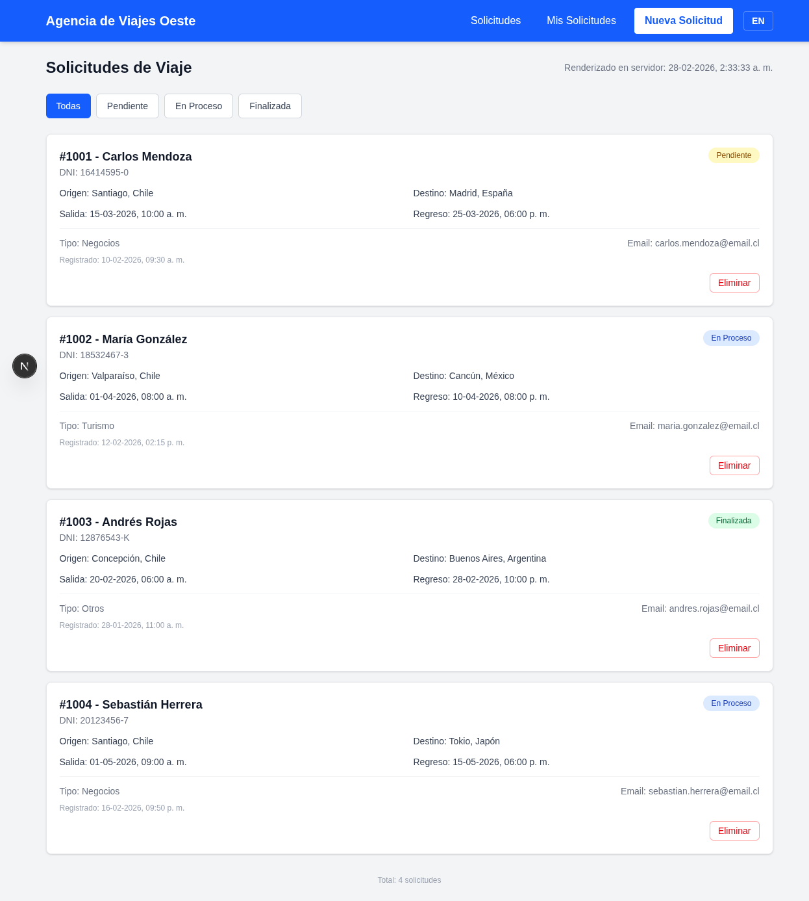

### Filtro por estado funcionando

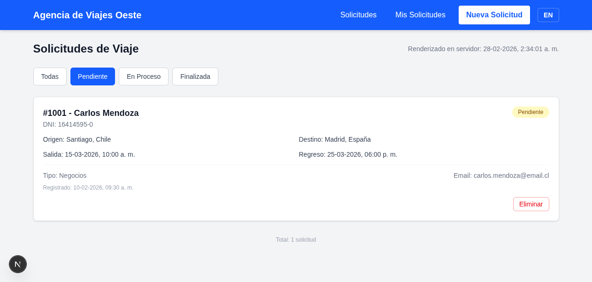

---

## Criterio 2: Interfaces con validaciones funcionales e internacionalizadas (10 pts)

### React Hook Form - Implementación

El formulario está construido con `react-hook-form` usando `useForm`, `register`, `handleSubmit`, `setValue`, `watch` y `formState: { errors }`. Las validaciones son declarativas e internacionalizadas con `t()` de react-i18next.

```tsx
// SolicitudForm.tsx - Uso de useForm con validaciones i18n
const {
  register,
  handleSubmit,
  setValue,
  watch,
  formState: { errors },
} = useForm<SolicitudFormData>({
  defaultValues: {
    tipoViaje: 'turismo',
    estado: 'pendiente',
  },
});
```

#### Validaciones con `register()` internacionalizadas

| Campo | Validaciones | Mensaje (ES) | Mensaje (EN) |
|-------|-------------|--------------|--------------|
| DNI | `required`, `pattern: /^\d{1,2}\.?\d{3}\.?\d{3}-[\dkK]$/` | "DNI es requerido" / "Formato de DNI inválido" | "ID number is required" / "Invalid ID format" |
| Nombre Cliente | `required` | "Nombre del cliente es requerido" | "Client name is required" |
| Email | `required`, `pattern: /^[^\s@]+@[^\s@]+\.[^\s@]+$/` | "Email es requerido" / "Formato de email inválido" | "Email is required" / "Invalid email format" |
| Origen | `required` | "Origen es requerido" | "Origin is required" |
| Destino | `required` | "Destino es requerido" | "Destination is required" |
| Fecha Salida | `required` | "Fecha de salida es requerida" | "Departure date is required" |
| Fecha Regreso | `required`, `validate` (posterior a salida) | "Fecha de regreso es requerida" | "Return date is required" |

```tsx
// Ejemplo: campo DNI con register + validaciones i18n
<input
  type="text"
  {...register('dni', {
    required: t('validation.dniRequired'),
    pattern: {
      value: /^\d{1,2}\.?\d{3}\.?\d{3}-[\dkK]$/,
      message: t('validation.dniFormat'),
    },
  })}
  placeholder={t('form.dniPlaceholder')}
  className={inputClass('dni')}
/>

// Ejemplo: fecha regreso con validate custom
{...register('fechaRegreso', {
  required: t('validation.fechaRegresoRequired'),
  validate: (value) => {
    const salida = watch('fechaSalida');
    if (salida && value && new Date(value) <= new Date(salida)) {
      return t('validation.fechaRegresoAfter');
    }
    return true;
  },
})}
```

#### Re-mount del formulario en cambio de idioma

El formulario usa `key={i18n.language}` para re-montarse cuando cambia el idioma, asegurando que los mensajes de validación se registren en el idioma correcto:

```tsx
<form key={i18n.language} onSubmit={handleSubmit(onSubmit)} className="space-y-5">
```

#### Validación dual: cliente + servidor

Los errores del backend (`json.fields`) se combinan con los del cliente para mostrar un único mensaje por campo:

```tsx
function fieldError(field: string) {
  const clientErr = errors[field as keyof SolicitudFormData]?.message;
  const serverErr = serverErrors[field];
  const msg = clientErr || serverErr;
  return msg ? <p className="text-red-600 text-sm mt-1">{msg}</p> : null;
}
```

### Formulario completo en español

El formulario incluye todos los campos requeridos: ID Solicitud (auto), DNI, Nombre Cliente (búsqueda), Email, Origen, Destino, Tipo de Viaje (select), Fecha Salida, Fecha Regreso, Fecha Registro (auto), Estado (radio buttons).

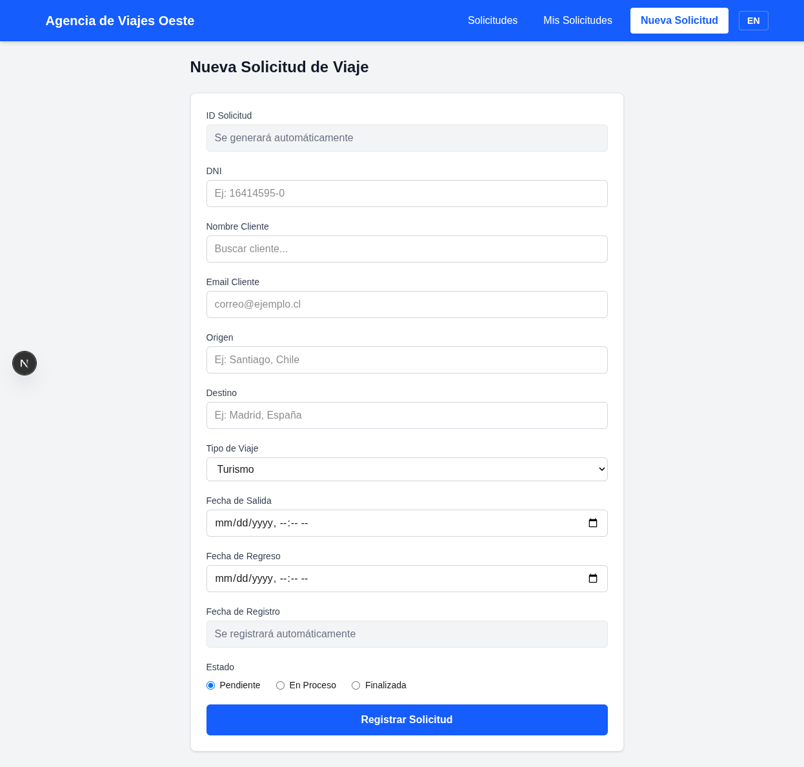

### Validaciones en español

Mensajes localizados: "DNI es requerido", "Nombre del cliente es requerido", "Email es requerido", etc.

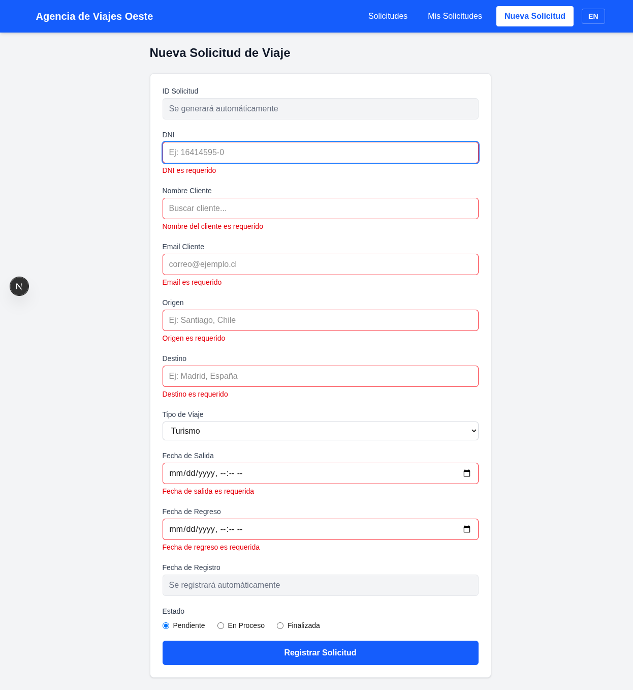

### Formulario completo en inglés

Todos los labels, placeholders y opciones traducidos al inglés.

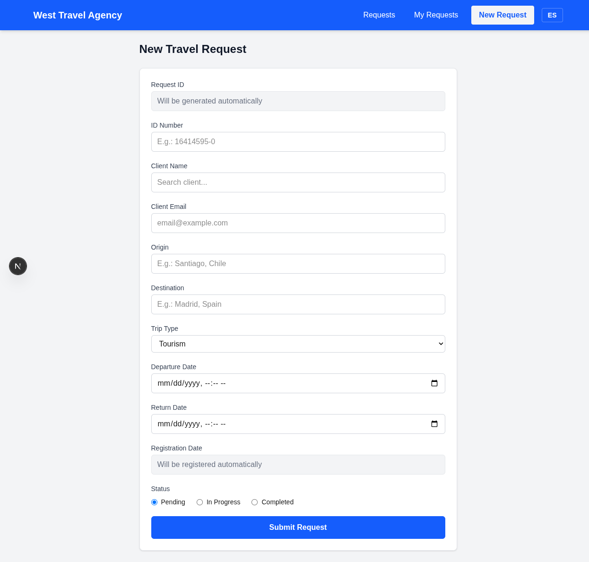

### Validaciones en inglés

Mensajes localizados: "ID number is required", "Client name is required", "Email is required", etc.

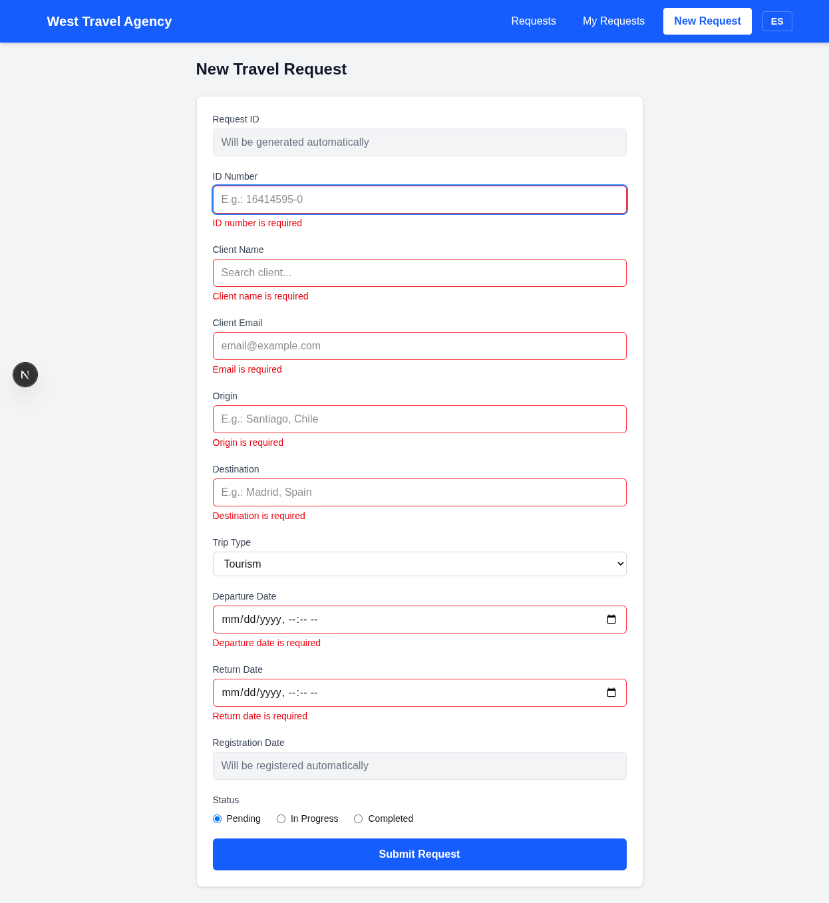

---

## Criterio 3: Implementación de Server-Side Rendering (SSR) con Next.js (15 pts)

Las páginas `/solicitudes` y `/mis-solicitudes` son **async Server Components** que realizan fetch de datos en el servidor. Se muestra un timestamp de renderizado en servidor como evidencia.

### Timestamp SSR visible


### Código fuente - `solicitudes/page.tsx` (Server Component)

```tsx
// async Server Component - SSR
export default async function SolicitudesPage({ searchParams }: PageProps) {
  const { estado } = await searchParams;
  return (
    <div>
      <SolicitudesHeader />
      <div className="mb-6">
        <FilterBar />  {/* Cargado con next/dynamic */}
      </div>
      <Suspense fallback={<SolicitudesSkeleton />}>
        <SolicitudesList estado={estado} />  {/* Fetch en servidor */}
      </Suspense>
    </div>
  );
}
```

### Código fuente - `mis-solicitudes/page.tsx` (Server Component)

```tsx
// async Server Component - SSR con fetch server-side
async function fetchSolicitudesByDni(dni: string): Promise<Solicitud[]> {
  const res = await fetch(
    `http://localhost:3001/api/solicitudes?dni=${encodeURIComponent(dni)}`,
    { cache: 'no-store' }
  );
  if (!res.ok) throw new Error('Error al obtener solicitudes');
  return res.json();
}

export default async function MisSolicitudesPage({ searchParams }: PageProps) {
  const { dni } = await searchParams;
  return (
    <div className="max-w-4xl mx-auto">
      <ClientHeader />
      <div className="bg-white rounded-lg shadow-sm border border-gray-200 p-6 mb-6">
        <ClientSearchForm />  {/* next/dynamic */}
      </div>
      {dni && (
        <Suspense fallback={<SolicitudesSkeleton />}>
          <SolicitudesResultados dni={dni} />  {/* Fetch en servidor */}
        </Suspense>
      )}
    </div>
  );
}
```

---

## Criterio 4: Modularización con next/dynamic (15 pts)

Se utiliza `next/dynamic` para carga diferida de componentes interactivos en todas las páginas:

| Página | Componente | Opciones |
|--------|-----------|----------|
| `/solicitudes` | `FilterBar` | `loading: () => skeleton` |
| `/solicitudes/nueva` | `SolicitudForm` | `ssr: false, loading: () => skeleton` |
| `/mis-solicitudes` | `ClientSearchForm` | `loading: () => skeleton` |
| `/solicitudes` | `SolicitudesList` | Usa `dynamic` internamente |
| `/mis-solicitudes` | `ClientSolicitudesList` | Usa `dynamic` internamente |

### Ejemplo - `solicitudes/nueva/page.tsx`

```tsx
const SolicitudForm = dynamic(() => import('@/components/SolicitudForm'), {
  ssr: false,
  loading: () => (
    <div className="space-y-5 animate-pulse">
      {[1, 2, 3, 4, 5, 6, 7, 8, 9, 10].map((i) => (
        <div key={i}>
          <div className="h-4 w-28 bg-gray-200 rounded mb-2" />
          <div className="h-10 w-full bg-gray-200 rounded-md" />
        </div>
      ))}
      <div className="h-12 w-full bg-gray-300 rounded-md" />
    </div>
  ),
});
```

---

## Criterio 5: Lazy loading de contenido dinámico (15 pts)

El contenido se carga dinámicamente según la necesidad del usuario:

- **Listado de solicitudes:** Se renderiza en servidor con `<Suspense>` y skeleton fallback
- **Formulario de nueva solicitud:** Se carga con `next/dynamic` y `ssr: false` (solo en cliente)
- **Resultados de búsqueda por DNI:** Solo se cargan cuando el cliente ingresa un DNI y presiona buscar
- **FilterBar:** Se carga de forma diferida con `next/dynamic`

Cada componente cargado de forma diferida muestra un skeleton animado (`animate-pulse`) mientras se carga.

---

## Criterio 6: Persistencia con API REST (15 pts)

El backend Express expone una API REST completa:

### Endpoints disponibles

| Método | Endpoint | Descripción |
|--------|----------|-------------|
| `GET` | `/api/solicitudes` | Listar solicitudes (filtros: `?estado=`, `?dni=`) |
| `POST` | `/api/solicitudes` | Crear solicitud (validación server-side) |
| `DELETE` | `/api/solicitudes/:id` | Eliminar solicitud |
| `GET` | `/api/clientes` | Listar clientes mock |

### API respondiendo solicitudes

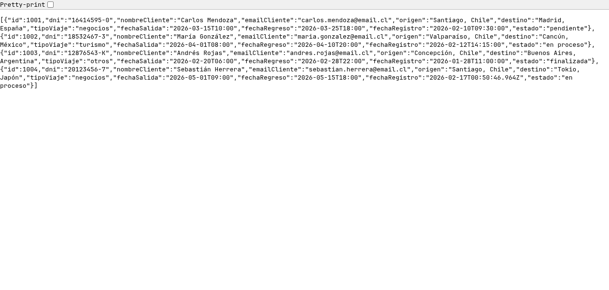

### API respondiendo clientes

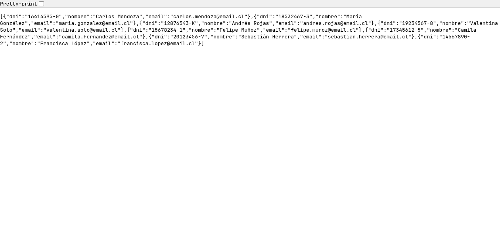

### API con filtro por DNI

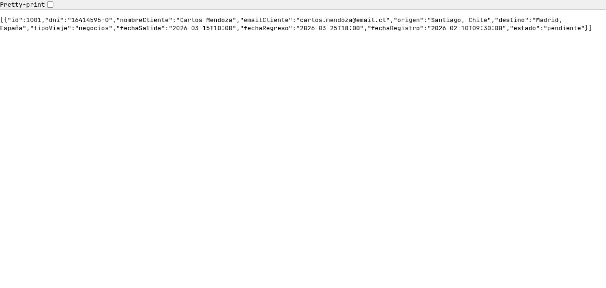

---

## Criterio 7: Skeleton Loaders (15 pts)

Se implementan skeleton loaders en todas las vistas:

### Componente `SolicitudesSkeleton.tsx`

```tsx
export default function SolicitudesSkeleton() {
  return (
    <div className="grid gap-4">
      {[1, 2, 3, 4].map((i) => (
        <div key={i}
          className="bg-white rounded-lg shadow-sm border border-gray-200 p-5 animate-pulse">
          <div className="flex items-start justify-between mb-3">
            <div>
              <div className="h-5 w-48 bg-gray-200 rounded mb-2" />
              <div className="h-4 w-32 bg-gray-200 rounded" />
            </div>
            <div className="h-6 w-20 bg-gray-200 rounded-full" />
          </div>
          <div className="grid grid-cols-2 gap-3 mb-3">
            <div className="h-4 w-36 bg-gray-200 rounded" />
            <div className="h-4 w-36 bg-gray-200 rounded" />
            <div className="h-4 w-40 bg-gray-200 rounded" />
            <div className="h-4 w-40 bg-gray-200 rounded" />
          </div>
          <div className="flex items-center justify-between border-t border-gray-100 pt-3">
            <div className="h-4 w-24 bg-gray-200 rounded" />
            <div className="h-4 w-44 bg-gray-200 rounded" />
          </div>
        </div>
      ))}
    </div>
  );
}
```

### Uso en las páginas

- `solicitudes/page.tsx`: `<Suspense fallback={<SolicitudesSkeleton />}>`
- `mis-solicitudes/page.tsx`: `<Suspense fallback={<SolicitudesSkeleton />}>`
- `solicitudes/nueva/page.tsx`: Skeleton inline en `next/dynamic loading`
- `FilterBar`: Skeleton inline en `next/dynamic loading`
- `ClientSearchForm`: Skeleton inline en `next/dynamic loading`

---

## Internacionalización (i18n) - Evidencia adicional

### Configuración de i18next (`src/lib/i18n.ts`)

Se usa `i18next` + `react-i18next` + `i18next-browser-languagedetector` con traducciones bundleadas (sin HTTP fetch):

```tsx
import i18n from 'i18next';
import { initReactI18next } from 'react-i18next';
import LanguageDetector from 'i18next-browser-languagedetector';

import es from '../../public/locales/es/common.json';
import en from '../../public/locales/en/common.json';

i18n
  .use(LanguageDetector)       // Detecta idioma del navegador
  .use(initReactI18next)       // Integración con React
  .init({
    resources: {
      es: { translation: es },
      en: { translation: en },
    },
    fallbackLng: 'es',
    supportedLngs: ['es', 'en'],
    detection: {
      order: ['localStorage', 'navigator'],  // Primero localStorage, luego navegador
      caches: ['localStorage'],
    },
  });
```

### Archivos de traducción

Estructura: `public/locales/{es,en}/common.json`

| Sección | Claves (ejemplo) | ES | EN |
|---------|-------------------|----|----|
| `nav` | `brand`, `solicitudes`, `misSolicitudes` | "Agencia de Viajes Oeste", "Solicitudes" | "West Travel Agency", "Requests" |
| `form` | `dni`, `origen`, `destino`, `submit` | "DNI", "Origen", "Destino", "Registrar Solicitud" | "ID Number", "Origin", "Destination", "Submit Request" |
| `validation` | `dniRequired`, `emailFormat`, `fechaRegresoAfter` | "DNI es requerido", "Formato de email inválido" | "ID number is required", "Invalid email format" |
| `filter` | `all`, `pendiente`, `enProceso`, `finalizada` | "Todas", "Pendiente", "En Proceso", "Finalizada" | "All", "Pending", "In Progress", "Completed" |
| `card` | `origen`, `destino`, `salida`, `regreso` | "Origen", "Destino", "Salida", "Regreso" | "Origin", "Destination", "Departure", "Return" |
| `client` | `title`, `dniLabel`, `search`, `results` | "Consultar Mis Solicitudes", "Buscar" | "Check My Requests", "Search" |
| `delete` | `confirm`, `delete` | "¿Eliminar la solicitud #{{id}}?" | "Delete request #{{id}}?" |

Soporte de **pluralización** con sufijo `_other`:
```json
"total": "Total: {{count}} solicitud",
"total_other": "Total: {{count}} solicitudes"
```

### Carga de contenido internacionalizado de forma diferida (next/dynamic)

Los componentes cargados con `next/dynamic` usan internamente `useTranslation()`, por lo que el contenido i18n se carga de forma diferida junto al componente:

| Componente (dynamic) | Usa i18n | Claves traducidas |
|----------------------|----------|-------------------|
| `SolicitudForm` | `useTranslation()` | `form.*`, `validation.*` |
| `FilterBar` | `useTranslation()` | `filter.*` |
| `ClientSearchForm` | `useTranslation()` | `client.*` |
| `ClienteSearch` | `useTranslation()` | `search.*` |
| `DeleteButton` | `useTranslation()` | `delete.*` |

### Vista agente en inglés

Toda la interfaz traducida: navbar, títulos, labels, filtros, badges de estado, botones y formatos de fecha.

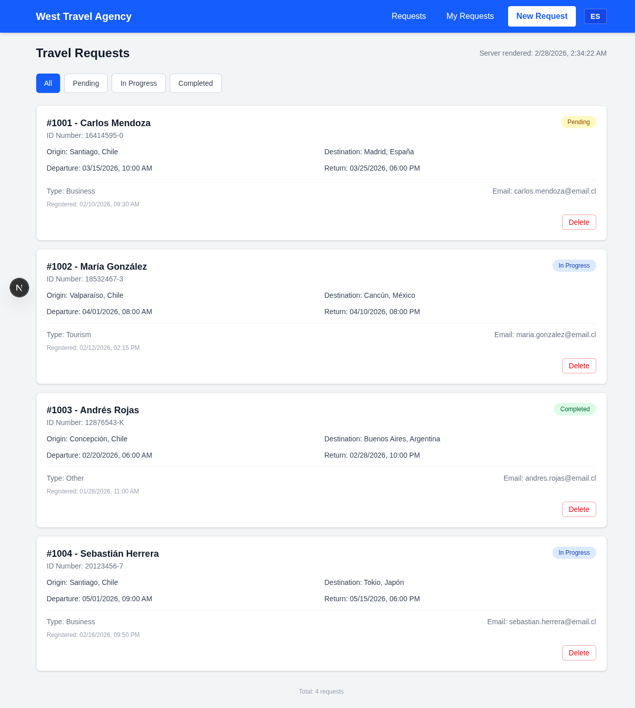

### Vista cliente en español

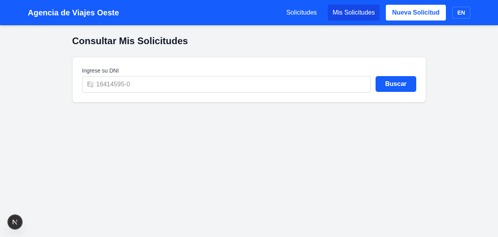

### Vista cliente con resultados (español)

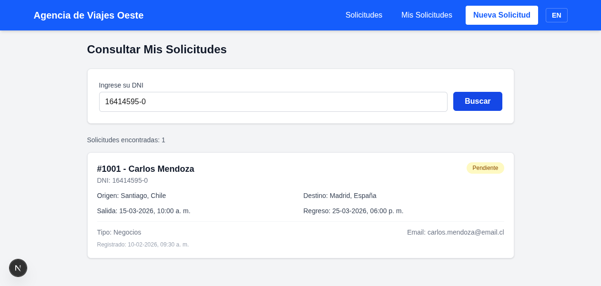

### Vista cliente en inglés

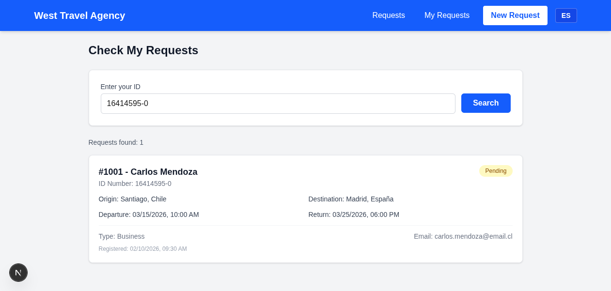

---
